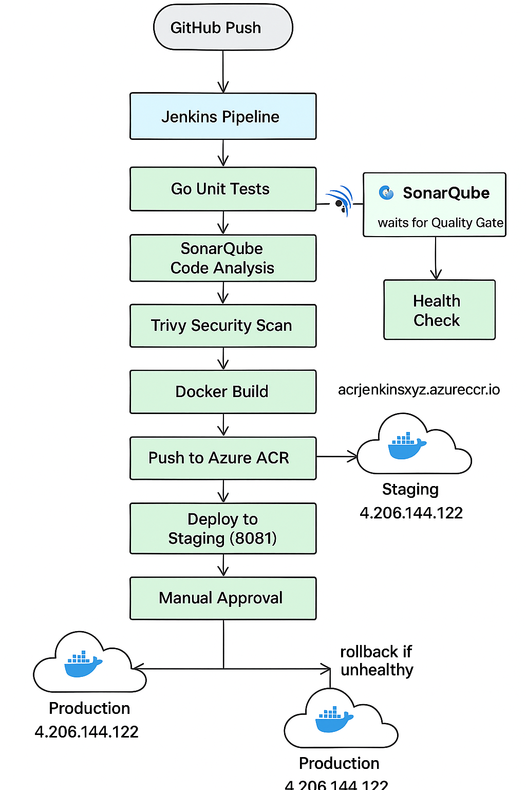

# Jenkins Production Pipeline
A compact, real-world CI/CD demo: Jenkins + SonarQube + Docker + Azure Container Registry with security and quality gates.

A product-style pipeline that runs Go unit tests, static analysis, container build & image scanning, then deploys to an Azure VM with health checks and rollback.

## Architecture / Workflow


<p align="center">
  
</p>

Notes:
- Jenkins triggers via webhook (or pollSCM '@daily' as fallback).
- Sonar analysis runs only when SonarScanner is available on the agent (marker file `sonar_ran` used internally).

## Tech stack

| Area | Tool | Purpose |
|---|---:|---|
| CI server | Jenkins | Declarative pipeline, orchestrates the workflow |
| VCS | GitHub | Source repository / webhooks |
| Language | Go (1.22/1.23) | Application language; unit tests are included |
| Container build | Docker / BuildKit | Build multi-stage Go image |
| Container registry | Azure Container Registry (ACR) | Store images (acrjenkinsxyz.azurecr.io) |
| Static analysis | SonarQube (with SonarScanner) | Quality Gate enforcement |
| Image scanning | Trivy | Security scanning of built image |
| Deployment host | Azure VM | Remote Docker runtime for staging & prod |
| Secrets & creds | Jenkins Credentials | ACR credentials, SSH deploy key, etc. |

## Azure resources (summary)

- Azure Container Registry (ACR) login server: `acrjenkinsxyz.azurecr.io`
- Deploy VM public IP: `4.206.144.122`
- Staging port on VM: `8081` → app container bound to container port 8080
- Production port on VM: `8080`

> This repository demonstrates the CI/CD flow; it does not provision Azure resources. Use ARM/Bicep/Terraform to provision ACR and VM in production.

## Pipeline stages (as implemented in `Jenkinsfile`)

| Stage | Description |
|---|---|
| Declarative: Checkout SCM | Checkout selected branch from GitHub |
| Go fmt & Unit Tests | Runs `go fmt` and `go test` under `app/`; archives `fmt.out` and `test.out` |
| Static Analysis (SonarQube) | Runs `sonar-scanner` (if present) under `withSonarQubeEnv`; creates `sonar_ran` marker on success |
| Quality Gate | `waitForQualityGate` (only if Sonar ran) — aborts pipeline on failure |
| Build Docker image | Builds multi-stage Docker image, tags as SHA and `latest` |
| Security scan (Trivy) | Runs `trivy image --exit-code 1 --severity HIGH,CRITICAL` and archives `trivy.out` |
| Push to ACR | Logs in and pushes both tags to ACR (uses Jenkins `acr-creds`) |
| Deploy to STAGING (remote) | SSH into VM using `deploy-ssh` key; pull image and run as `myapp-staging` on port 8081 |
| Health check (staging) | Runs `scripts/health_check.sh` against the staging URL; fails if unhealthy |
| Approval for PROD | Manual input step before production deploy (only when `DEPLOY_TO == 'prod'` and branch is `main`) |
| Deploy to PROD (with rollback) | Pulls image, replaces prod container, checks health on localhost inside VM, and rolls back to previous image if health fails |
| Post actions | Success/Failure echo messages and archived artifacts |

## Key features

- Quality gate integration with SonarQube (pipeline aborts on failed Quality Gate).
- Security gate via Trivy scanning; pipeline fails on HIGH/CRITICAL findings.
- Staging environment with automated health checks before promotion.
- Manual approval step for production deployments.
- Automatic rollback on failed production health checks.
- Containerized build (multi-stage) for minimal final image (distroless base).
- Parameterized pipeline: `BRANCH`, `DEPLOY_TO`, `DEPLOY_IP`, `ACR`, `APP`, `RUN_SONAR`.

## Credentials & configuration used by the pipeline

- Jenkins credential `acr-creds` (username/password) — used to login to ACR.
- Jenkins credential `deploy-ssh` — SSH private key entry (type: "SSH Username with private key").
- SonarQube server configured in Jenkins as `sonar-local` (used by `withSonarQubeEnv`).

Security note: The pipeline avoids exposing secrets in logs, but keep secrets in Jenkins Credentials (not in repo). Avoid Groovy string interpolation with secrets; prefer environment variables or here-doc style shell blocks.

## Reproduce / demo checklist

Prerequisites:
- A Jenkins instance with: Pipeline plugin, Credentials Binding plugin, SSH Credentials, SonarQube plugin + server, Docker (or Docker-in-Docker) on build agents, Trivy (or allow pipeline to skip if missing).
- An Azure Container Registry and a reachable Azure VM with Docker installed.
- Create Jenkins credentials:
  - `acr-creds` — username/password for ACR
  - `deploy-ssh` — SSH key (type: SSH Username with private key)
- (Optional) Install SonarScanner on the agent or run Sonar via Docker (pipeline currently checks for `sonar-scanner` binary).

Quick demo steps:
1. Fork/clone this repo to GitHub and configure your Jenkins multibranch pipeline or a declarative pipeline referencing this repo.
2. In Jenkins, add credentials for `acr-creds` and `deploy-ssh` and configure SonarQube server ID `sonar-local` if available.
3. Push code to `main` and trigger Jenkins via webhook (or run a build manually).
4. Watch pipeline execute: tests → sonar (if available) → build → trivy → push to ACR → deploy to staging → health check.
5. Approve promotion and the pipeline deploys to production and verifies health with automatic rollback on failure.

Helpful commands (local / admin):

- Make health script executable and commit:

```bash
git update-index --add --chmod=+x scripts/health_check.sh
git commit -m "chore: make health_check.sh executable"
git push
```

- If SonarScanner is not installed on agents, run Sonar in Docker (example):

```bash
docker run --rm -v "$(pwd):/src" -w /src sonarsource/sonar-scanner-cli \
  -Dsonar.projectKey=myapp -Dsonar.sources=app -Dsonar.tests=app
```

## What I learned

- Declarative pipelines are strict about what belongs in `options` vs. steps; plugin-provided wrappers sometimes must be used in different places or via `wrap`/`with...`.
- Agents vary widely: some have SonarScanner/Trivy/docker; make pipeline resilient (conditional checks and fallbacks) so CI remains robust.
- SSH integration in Jenkins can be done with `sshagent` (plugin) or `withCredentials(sshUserPrivateKey)` which writes a temp key file — the latter avoids depending on the SSH Agent plugin.
- Git does not always preserve executable bits across systems; set +x in the repo for scripts you expect to execute.

## Future improvements

- Use IaC (Terraform / Bicep) to provision ACR, VM(s), and network resources for a repeatable demo environment.
- Run SonarScanner inside a container step to avoid agent dependencies.
- Replace ad-hoc SSH/deploy logic with an agentless orchestration (Ansible, Azure WebApp, or AKS) for safer rollbacks and health checks.
- Add integration tests and more unit tests; add image signing and SBOM generation for stronger supply-chain security.
- Improve secret handling: restrict masking, avoid interpolating secrets in Groovy double-quoted strings.
- Add pipeline caching for Go modules and Docker layer cache to speed builds.

## Repo structure

```
├── Dockerfile                  # Multi-stage Go build -> distroless image
├── Jenkinsfile                 # Declarative Jenkins pipeline
├── README.md                   # <-- you are reading this
├── sonar-project.properties    # SonarQube project config
├── scripts/
│   └── health_check.sh         # Health-check helper (curl loop)
└── app/
    ├── main.go                 # Simple Go web app (/, /health)
    ├── app_test.go             # Sample unit test
    └── go.mod
```

## Notes / Gotchas

- If SonarScanner or Trivy are not installed on the agent, the pipeline contains checks to skip them (Sonar will be skipped unless the binary exists; Trivy is expected — you can run it in Docker if not present).
- If `sshagent` plugin is not installed, the pipeline uses `withCredentials(sshUserPrivateKey)` and `ssh -i $SSH_KEYFILE` to run remote commands.
- Jenkins will warn when secrets are interpolated into Groovy strings; prefer safer shell invocation styles.

---

## Author

Neelotpal Chaulia  
PG in Cloud Computing @ Loyalist College

- LinkedIn: https://linkedin.com/in/neelchaulia
- GitHub: https://github.com/neelotpalchaulia

